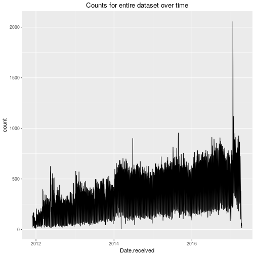
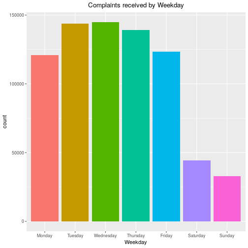
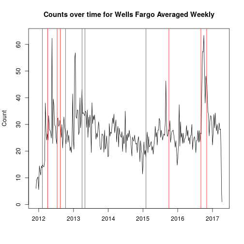
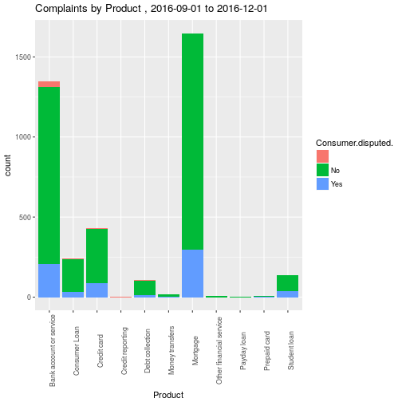
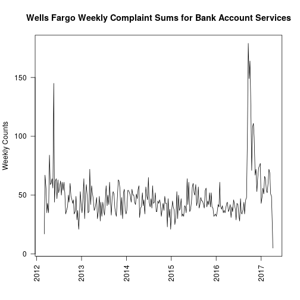
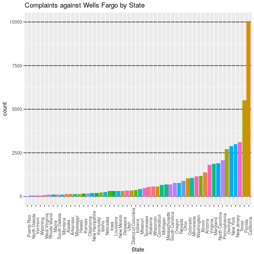
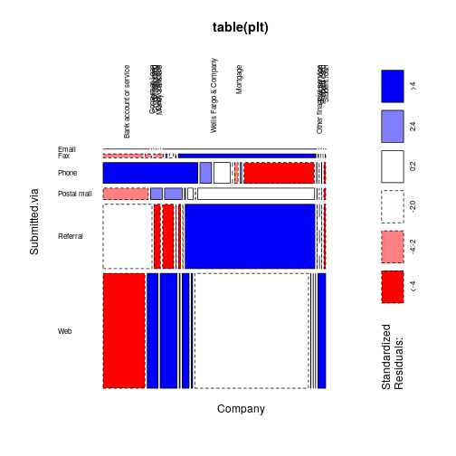
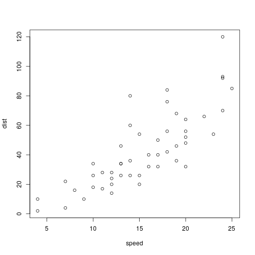

Consumer Complaints Database (amassed and made available by the Consumer Financial Protection Bureau)
========================================================
author: Mark Schott
date: 4/24/2017
autosize: true

Dataset Information
========================================================
- Data consists of 18 variables, and about 750000 rows
- Spans from December 2011 to the present
  - 10 categorical variables (such as)
      - State
      - Company
      - Product/Sub-Product
      - Issue/Sub-Issue
  - 2 date fields
  - 2 yes/no fields
  - 1 unique complaint ID
  - Zip code
  - 2 text fields (one for the consumer filing the complaint and one for the company's response)

Data trimming
========================================================
  - Disregard 
      - Zip Code
      - Complaint ID
      - Date sent to company (in favor of date received by the CFPB)
      - Company Public Response
      
Loading in the needed libraries
========================================================

```r
  library(knitr)
  knitr::opts_chunk$set
```

```
function (...) 
{
    dots = list(...)
    if (length(dots) == 0) 
        return()
    if (is.null(names(dots)) && length(dots) == 1 && is.list(dots[[1]])) 
        if (length(dots <- dots[[1]]) == 0) 
            return()
    defaults <<- merge(dots)
    invisible(NULL)
}
<environment: 0x2369340>
```

```r
  # Basic plotting
  library(graphics)
  # Data frame manipulation
  library(dplyr)
  # Fancier plotting
  library(ggplot2)
  # Time series manipulation
  library(xts)
```
 
Loading in the data
========================================================

```r
setwd("~/data/consumer_complaints")
## Read in main data
data = readRDS('data/complaints.Rda')
## Read in state names and 2016 US population estimates
pops = read.csv("data/us_populations.csv", stringsAsFactors = F)
## merge for later ease
data = inner_join(data, pops, by=c('State'='abbreviation'))
rm(pops)
```

Initial Dataset Exploration
========================================================


Initial Dataset Exploration
========================================================


Statistically Significant? Day of the week
========================================================
  - First do a bartlett test (multi-sample variance test) on the weekdays (exclude weekends)

```

	Bartlett test of homogeneity of variances

data:  plt$count and plt$weekday
Bartlett's K-squared = 13.202, df = 4, p-value = 0.01033
```
- The variances aren't equal so simple linear aov will not be appropriate

Counts by month?
========================================================


Statistically Significant? Months
========================================================
  - Bartlett test now for this case

```

	Bartlett test of homogeneity of variances

data:  plt$count and plt$month
Bartlett's K-squared = 31.049, df = 11, p-value = 0.001082
```
- Again variances aren't equal so simple linear aov will not be appropriate
- Is this type of analysis even appropriate for time series? 

Question of Interest
========================================================
  - How do complaints affect various companies?
      - Are they suggestive of subsequent troubles
      - Are there any companies that are more egregious than others?
      - Are there any specific states that are more afflicted than others? More vocal?

Specific Focus
========================================================
  - Wells Fargo Bank
      -  Second-largest bank in deposits, home mortgage servicing, and debit cards.
      -   September 2016 
          - Scandal where 2 million bank accounts were opened by employees to boost numbers
      - October 2016 
          - Settled a racketeering lawsuit for overcharging home owners for appraisals

Wells Fargo EDA
========================================================

- Each red line represents a controversy for the bank 
- A particularly interesting one is in September of 2016

Wells Fargo EDA
========================================================


Wells Fargo Weekly Complaint Mean for Bank Account Services
========================================================
title=false



Wells Fargo EDA
========================================================

Continued...
========================================================


Continued...
========================================================


Relevant Links
========================================================

- [Consumer Complaints Database](https://catalog.data.gov/dataset/consumer-complaint-database#topic=consumer_navigation)

- [Customer Financial Protection Bureau](https://cfpb.gov)

- [Database information](https://cfpb.github.io/api/ccdb//fields.html)

Notes
========================================================
-Concerning the Issue variable

"On December 18, 2013 the issues for student loan complaints were revised. “Repaying your loan” and “Problems when you are unable to pay” were removed and “Can’t pay my loan” and “Dealing with my lender or servicer” were added. Complaints received beginning on that date reflect this change. Complaints received before that date remain unchanged."

Slide With Code
========================================================


```r
summary(cars)
```

```
     speed           dist       
 Min.   : 4.0   Min.   :  2.00  
 1st Qu.:12.0   1st Qu.: 26.00  
 Median :15.0   Median : 36.00  
 Mean   :15.4   Mean   : 42.98  
 3rd Qu.:19.0   3rd Qu.: 56.00  
 Max.   :25.0   Max.   :120.00  
```

Slide With Plot
========================================================


